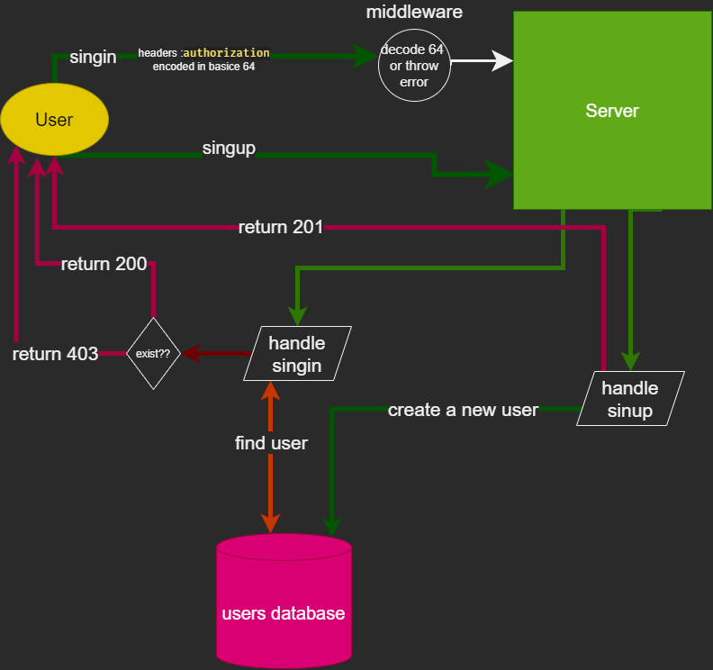

# basic-auth

Links:

- [basic-auth-heroku](https://jallad-basic-auth.herokuapp.com/)
- [readMe](https://github.com/Ahmadjlallad/basic-auth#readme)
- [latest PR](https://github.com/Ahmadjlallad/basic-auth/pull/2)
- [actions](https://github.com/Ahmadjlallad/basic-auth/actions)

- problem domain description
  - As a user, I want to create a new account so that I may later login
  - As a user, I want to login to my account so that I may access protected information
- steps
  1. [x] create a route to POST request to the/signup, return a 201 status code if successful
  2. [x] create a route to POST request to the/singin, return a 200 status code if successful
  3. [x] create a middleware to check if the user provided a valid credentials
  4. [x] create user model to store user information

## Documentation


`/singin` url use to login basic 64 encoded credentials
`/signup` url use to signup information in the bode
hash using bcrypt to encrypt the password

## jsDoc

```javascript
/**
 * signIn a middleware to check if the user provided an authenticated credentials or not
 * @param {express.Request} req
 * @param {express.Response} res
 * @param {express.NextFunction} next
 */
const signIn = (req, res, next) => {
  req.headers.authorization = req.headers.authorization.split(" ").pop();
  let decodedString = base64.decode(req.headers.authorization);
  let [username, password] = decodedString.split(":");
  if (username !== "" && password !== "") {
    req.headers.authorization = {
      ...req.headers.authorization,
      username,
      password,
    };
    next();
  } else throw new Error("Invalid credentials");
};
/**
 * Users Model
 * @param {string} username
 * @param {string} password
 * username and password are required
 * used to create a new user
 */
const Users = sequelize.define("User", {
  username: {
    type: DataTypes.STRING,
    allowNull: false,
  },

  password: {
    type: DataTypes.STRING,
    allowNull: false,
  },
});
```
